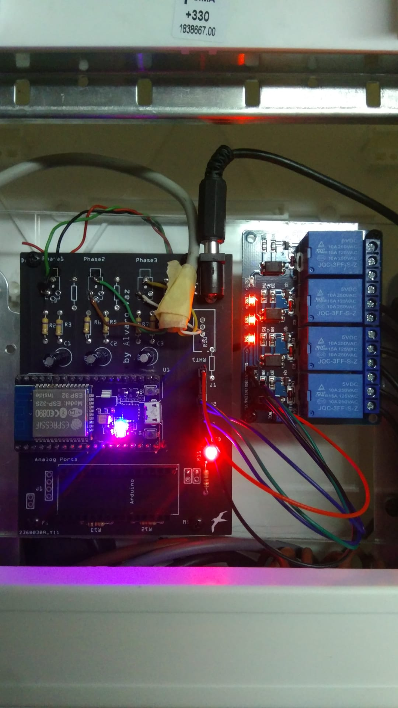
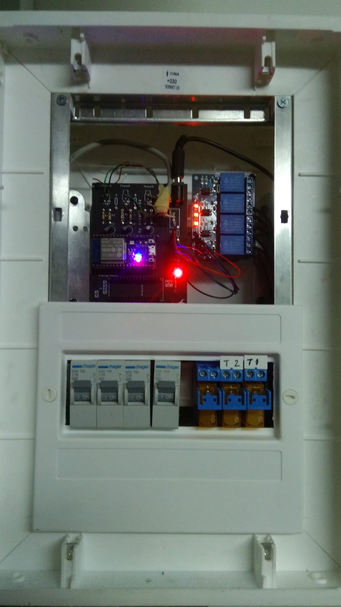

# ESP32 House Current Monitoring

# Use Case
I´ve first tried to develop this code when i wanted to monitor my house consumption and to be on top of my solar production.
Side note my house has a 3 phase connection so i have a 3 phase inverter installed.
Displaying the information in real time can give me an edge on when or what phase of the house can i use some electronic device
to better manage my electric bill.
I choose MQTT as the protocol used on this project, using Node-Red and MOSQUITTO as a broker on my Raspberry Pi.

# Features
It has 3 phases being processed by the ESP32 and sent to 3 different topics.
There are 3 relays that control 3 sockets off a room, having control over them also.

#Too develop
Adding a 4 phase to have complete 3 phase of the house plus the solar current input.
But for now it will do

# Image
This is the board made by me with all the other components(relays,power relays and switches for added security)

Here is the complete hardware system
	

 
# Enjoy!

